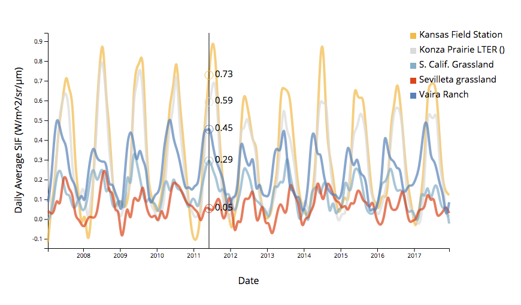

# Solar-Induced Chlorophyll Fluorescence

## An interactive timeseries

**interactive time series | updated May 9 2018 | grouped, continuous timeseries data | Contributors: [Lila Leatherman](https://github.com/lleather)**

**Prepared for GEOG 572: Geovisualization, Oregon State University**




##Overview

This is an interactive **time series** graph, suitable for visualizing **continuous** data. Unlike a [streamgraph](https://bl.ocks.org/mbostock/4060954), this interfave is more suitable for visualizing **cyclical data**. The interactive tooltip, which displays the value for each series, helps **compare values among groups**. 

## Data

These data displayed are monthly averages of daily average solar-induced chlorophyll fluorescence (SIF). Global SIF is available from [NASA](are available from [NASA](https://avdc.gsfc.nasa.gov/pub/data/satellite/MetOp/GOME_F/)) at 0.5 degree spatial resolution. These data are extracted to eddy covariance flux tower sites in the [Ameriflux](http://ameriflux.lbl.gov/) network. These sites in particular were chosen as grassy ecosystems that experience varying climate gradients. The distinct patterns in production and chlorophyll fluorescence are evident in in the distinct temporal patterns of production. 

## Major Functions

### html functions


**Multiple series plotted by nesting data**

In order to visualize multiple variables separately, in a ["long"](https://sejdemyr.github.io/r-tutorials/basics/wide-and-long/) dataset, I [nested](https://amber.rbind.io/blog/2017/05/02/d3nest/) the dataframe by a grouping variable, "name", which is unique for each site in the dataset. 

```
​```javascript
// nest the data by group
        var nest = d3.nest()
            .key(function(d) {
                return d.name; // variable to nest by
            } )
            .entries(data);
​```
```

**Line plotted using interpolation**

Creating a line based on interpolation between data points allows the tooltip display function to display continuous data, rather than only displaying data at points where the data appear in the original data set.

**Interactive tooltip**

A mouseover function provides colored circles and text that represent the interpolated value for each group at the x-value where the mouse is located. The tooltip is only visible when the mouse is on the plot. 


## More similar data visualizations

* [Cubism](http://square.github.io/cubism/): for visualizing grouped time series, separately. Best-suited for data aquired in real-time.
* [D3-timeseries](http://mcaule.github.io/d3-timeseries/): provides multiple add-ons for visualizing time series, but was difficult for me to adapt and implement.

## Primary sources

* nesting data: [Amber Thomas](https://amber.rbind.io/blog/2017/05/02/d3nest/0)
* mouseover function: [larsenmtl](https://bl.ocks.org/larsenmtl/e3b8b7c2ca4787f77d78f58d41c3da91)

